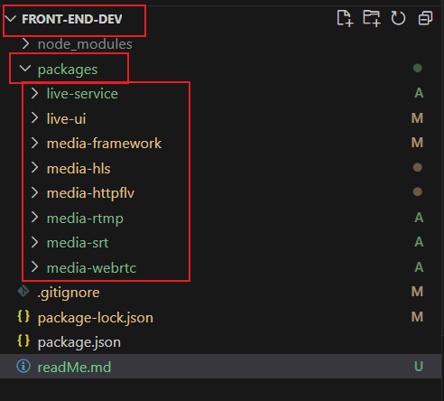

# 搭建前端项目

### 这是项目结构

分为最外层总仓库和里层8个仓库
注意保持目录一致

# clone下载

`live-dev`: `https://github.com/three-chen/live-dev.git`

`live-ui`:`https://github.com/three-chen/live-ui.git`

`live-service`:`https://github.com/three-chen/live-service.git`

剩下的懒得写了，去我仓库找

# 安装

`front-end-dev`目录下执行`npm i`即可

# 启动

进入`live-ui`目录下，执行`npm run dev`

# 搭建后端项目

需要环境docker、ffmpeg(最好是windows，linux没测过，估计有问题)

